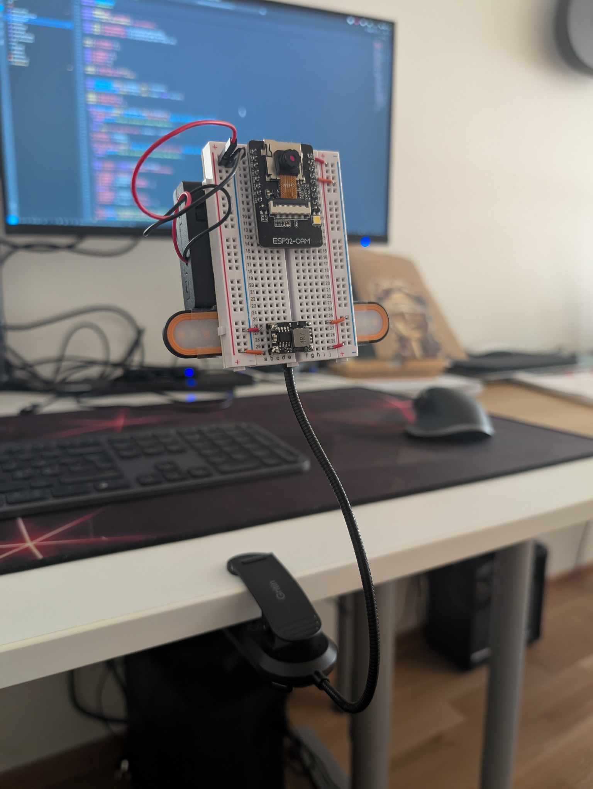
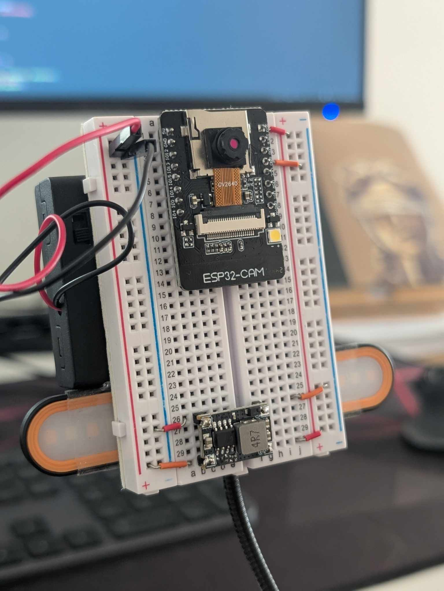
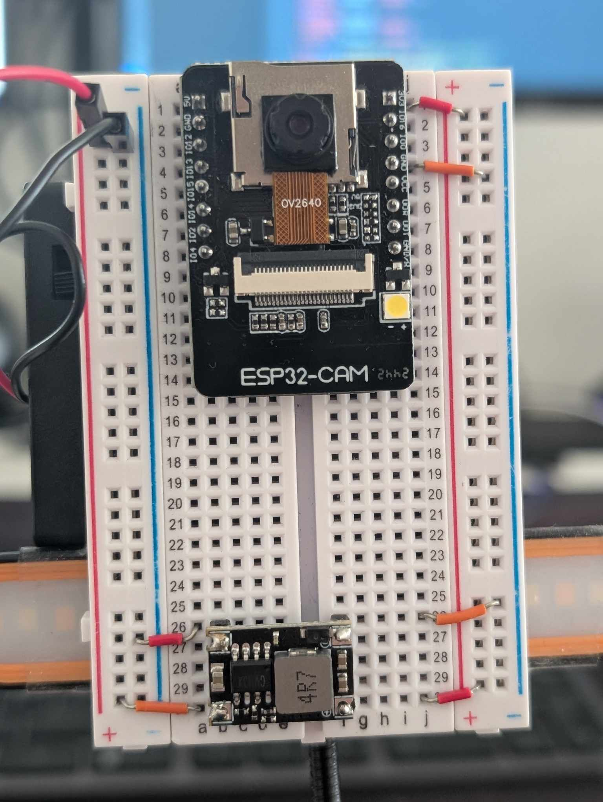
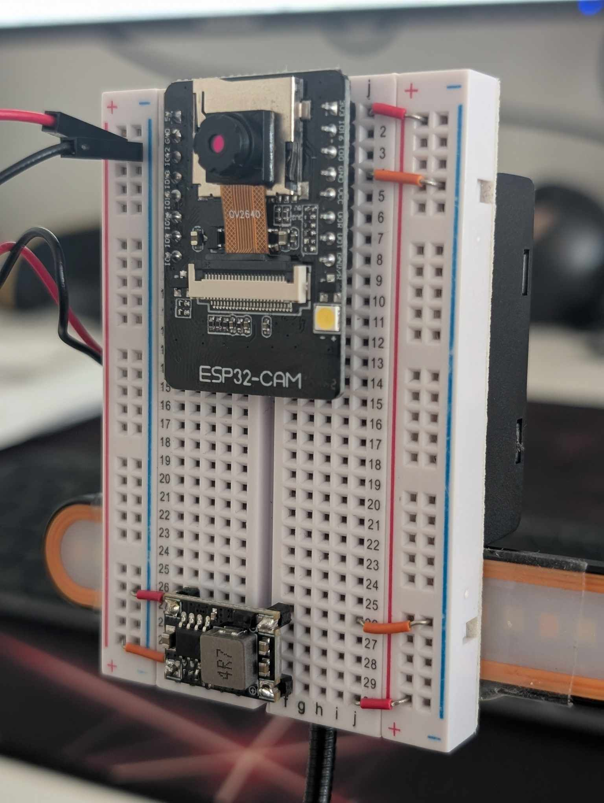

# ESP32-CAM Object Detection & Video Streaming

This is an RTOS based ESP32-CAM project that lets you run an Edge Impulse object detection model alongside an MJPEG video streaming server.


## Hardware Requirements

The only essential device is the ESP32-CAM board. There are several versions available on the market, with the cheapest option likely found on AliExpress. I use the ESP32-AI Thinker-based board. The easiest way to upload the code to it is by buying the mounting slot (shield), which adds a USB port for easy flashing.

There are other ways to upload the code, of course, through the data ports on the ESP32. However, if you want to go that route, it's up to you. If you wish to replicate the setup from the image, you can buy:

- A battery holder for 4 AAA or AA batteries (6V total)
- A buck converter step-down to 3.3V
- Several jumper cables
- A breadboard
- Something to create a tripod effect (a tripod works best, but I personally used a book reading light—the real DIY hero!)
- An ESP32-CAM microcontroller



## How It Works

The project runs two main tasks on separate cores:

- **Core 0:** Handles the MJPEG server for serving clients and streaming video.
- **Core 1:** Runs the object detection inference.

Inference is **not** performed on every single frame, as processing time depends on the model size. Instead, the video stream runs continuously, and a tiny JS script in `index.html` dynamically updates centroids. The actual drawing happens on the client side while streaming, while live inference runs on the ESP32.

Currently, this setup works with **FOMO** from Edge Impulse, as it's the only model that can run object detection with an acceptable time delay. The script includes three buttons that allow you to enable/disable individual centroids, bounding boxes, and a single global centroid (which calculates the mean value of centroids—works really well for a single class and low resolution).

## How to Run

1. This is a PlatformIO-based project, so make sure to install it. The best and easiest way is to use the VS Code extension.
2. Train your **object detection model** on Edge Impulse, export it as an Arduino Library, and copy the generated files into the `src` folder.
3. Open `inference.hpp`, `shared_buffer.hpp`, and `server.hpp`, and include your model's header file:

   ```cpp
   #include "your-own-model_inferencing.h"

   ```
3. Create a `secrets.h` file inside the `src` folder and add your Wi-Fi credentials:

   ```cpp
   #define SSID "your_wifi_ssid"
   #define PASSWORD "your_wifi_password"
   ```
4. Compile and upload the firmware to your ESP32-CAM.
5. Run the index.html file on your browser to see the live video stream with object detection. You can use Live Server or any other server to serve the file.

## Some Additional Images



